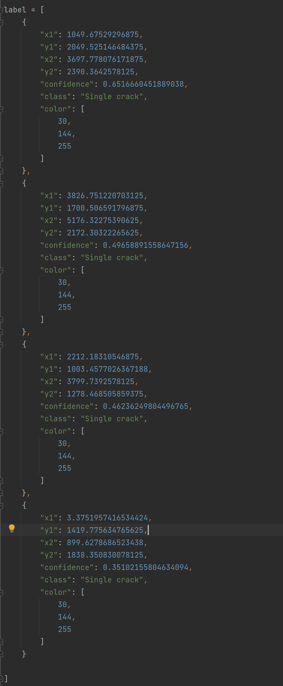

# Damage Detection by torchserve
___

## Preparation
1. Create conda environment  
In terminal, run:  
`conda create -n damage_detection python=3.7 -y`,  
Then `conda activate damage_detection`  
2. install requirements.txt  
`pip install -r requirements.txt`  
   (For GPU environment, depends on cuda version, check on the right installation [here](https://pytorch.org/get-started/locally/).  
   For example, `pip install torch torchvision torchaudio -U --extra-index-url https://download.pytorch.org/whl/cu113`

3.Download compiled model file and folder  
Download model_serve folder file `damage_detection.mar` and/or `damage_detection_cpu.mar` under project root

---
## Production model serving
1. Start model serving  
For GPU:  
Under project root, in terminal run:  
`torchserve --start --model-store model_store --models damage_detection=damage_detection.mar --ts-config config.properties`  
   (or in other working directory provide correct model_store folder path and config.properties file path.)  
For CPU only environment:  
`torchserve --start --model-store model_store --models damage_detection=damage_detection_cpu.mar --ts-config config.properties`

2. Test model serving running
Under project root, run:  
`curl localhost:8080/predictions/damage_detection -T data/test_image.jpg`  
or to test Wechat with RGBA image file(s), under project root, run:  
`curl localhost:8080/predictions/damage_detection -T data/test_RGBA.jpg`  
__(Caution: image send must be less than `8MB`, otherwise image may reject the image. Better to resize image within 2k by 2k resolution before sending.)__ 

Then paste the result from the return into `test_serving.py` of `label` variable.
Like:  
  

Then run `test_serving.py` to verify detection result.

3. Stop serving model 
Simply run `torchserve --stop` at the same terminal that starts torchserve